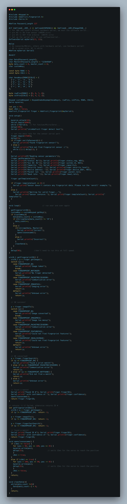

# Brandon - Fingerprint ID Safe
This is a safe that will open with the use of a fingerprint sensor or a password. The safe uses a servo and L brackets to turn the lock, and an arduino determines if the passcode or fingerprint is correct.

| **Engineer** | **School** | **Area of Interest** | **Grade** |
|:--:|:--:|:--:|:--:|
| Brandon | Mission San Jose High School | Aerospace Engineering | Incoming Senior

# Final Milestone
My final milestone was fixing many of the major bugs within my project. I resolved issues with the speaker and servo and improved the locking design slightly. At this point, the fingerprint safe is complete.

# Fifth Milestone
My fifth milestone was completing the locking mechanism and creating the false bottom. I also attached the fingerprint sensor and servo onto the box. I encountered some issues with getting the servo and L bracket to stay put while the glue set, but I found that by placing the box on its side the servo would stay put while the glue dried. For the L bracket, I used a small piece of wood to help keep the L bracket in place on the servo arm while the glue dried. I plan to work on bug fixes in the future to further improve the safe's design.

# Fourth Milestone
My fourth milestone was adding a speaker to the safe. After watching a short tutorial, I was able to apply my musical knowledge to the arduino's code and get it to play a short tune when the safe opens and closes. Initially, the speaker's volume was too loud, so I had to figure out a way to include a resistor into the circuit. I accomplished this by twisting the resistor's wire around the speaker's ground and connecting the other end directly into the arduino. Although the setup seems unstable, the circuit works perfectly and operates at a reasonable volume and even incorporates the servo's turning moise to hide the speaker's abrupt ending once the tune stops.

# Third Milestone
My third milestone was completing the safe and connecting all of the components together. I encountered some issues when my code would not compare two variables due to their differing types, but I was ultimately able to resolve the issue. Furthermore, I was able to reprogram the keypad to check for different password lengths rather than a predetermined amount, increasing the security of the device. I also drilled holes into the side of the safe to put the wires through and installed an impromptu switch to turn the device on and off. In the future, I plan to include a speaker to hide the sound of the servo turning, secure the locking mechanism, and hide the wiring to make the safe look better overall.

# Second Milestone
My second milestone was connecting the keypad, fingerprint sensor, and servo together. Though I encountered some issues with the motor twitching, I ultimately decided to ignore it since the locking mechanism would be unlikely to completely fail due to small movements of the motor. The safe will now open and close with either a fingerprint or a passcode. In addition, the safe still needs a way to be turned off, whether that be through the use of two wires or with a switch. Finally, I still need to determine how I will mount the locking system into the safe as well as figure out how to install both the fingerprint sensor and the keypad on the safe front, but once those two issues are resolved there will likely be no further issues hindering the safe's completion. 

# First Milestone
  

My first milestone was getting the fingerprint sensor to register and recognize fingerprints. Currently, the fingerprint sensor is hooked up to two LEDs, one of which will turn on depending on if the fingerprint is recognized or not. However, I had some trouble deciphering the sample code that made the fingerprint sensor work so that I could include my own code within it to have the arduino turn on the lights. I also had to solve the issue of whether I should include a way to recode the fingerprint sensor to accept different fingerprints, but I ultimately decided against doing so. The entire setup works smoothly, but I still need to build a switch into the system to be able to turn off the sensor at will. Furthermore, I plan to recode the arduino to cause the safe to open instead of simply turning on LEDs. Once the safe arrives, I will begin working on the safe itself and hook it up to a keypad as well as the fingerprint sensor.

